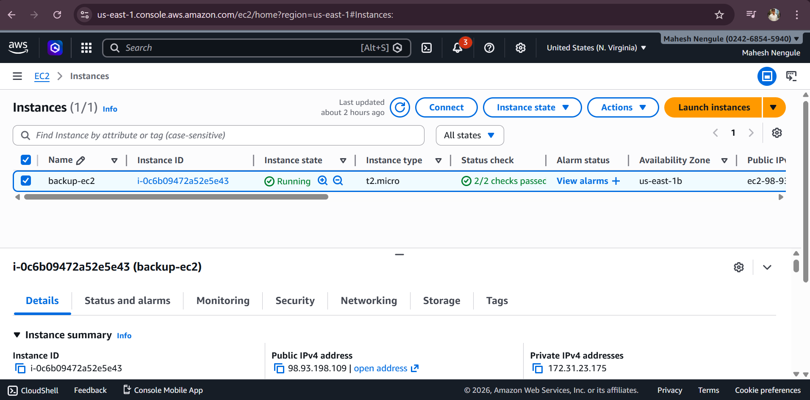
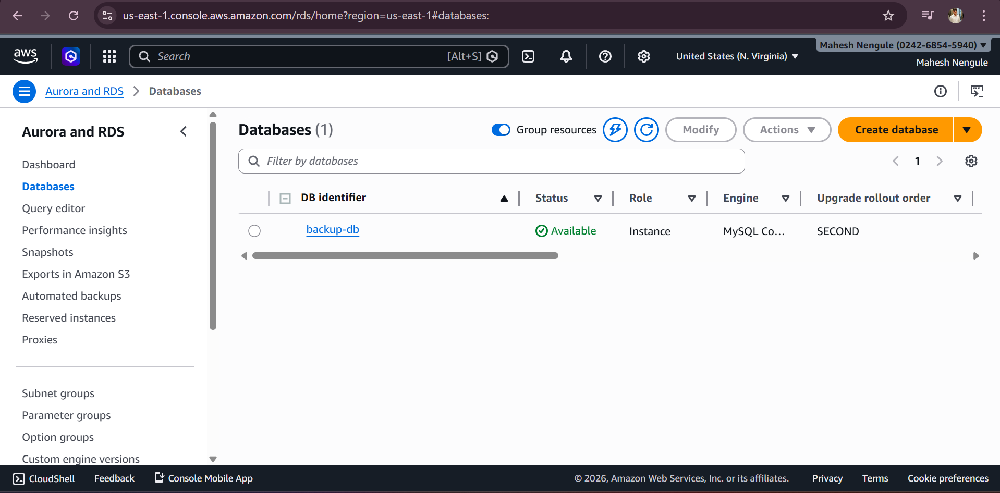
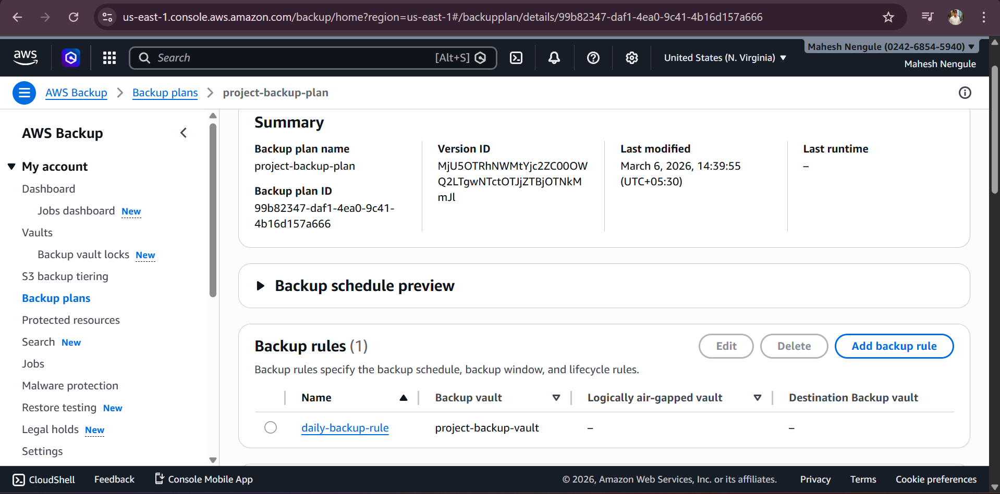
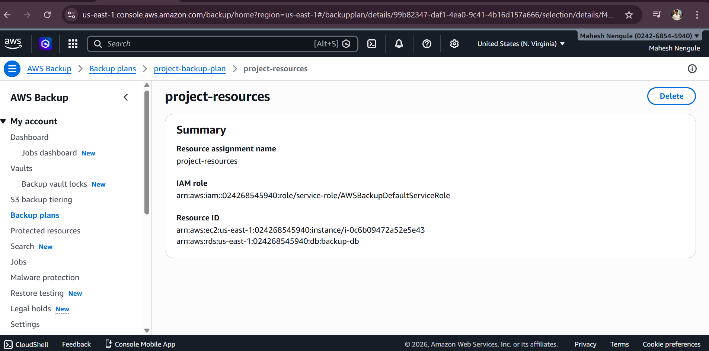
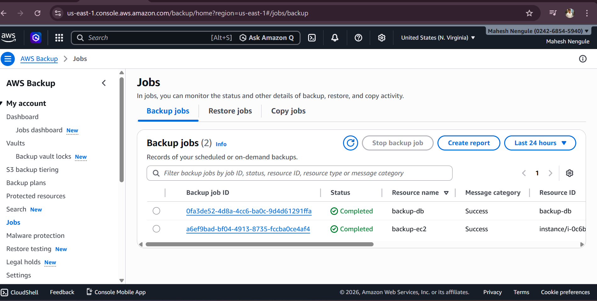
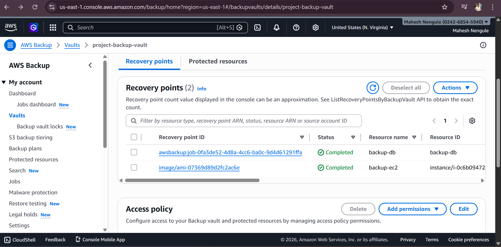

# 🚀 AWS Backup Plan for EC2 and RDS

## 📌 Project Overview

This project demonstrates how to implement a **centralized backup and recovery strategy** for AWS resources using **AWS Backup**.

The goal of this project was to protect critical infrastructure resources such as **EC2 instances and RDS databases** by configuring an automated backup plan and validating the recovery points.

This hands-on project helped in understanding **data protection, disaster recovery, and automated backups in AWS cloud environments**.

---

# 🏗 Architecture

The architecture includes:

- **Amazon EC2** – Web server hosting sample data
- **Amazon RDS (MySQL)** – Database storing sample records
- **AWS Backup Vault** – Centralized backup storage
- **Backup Plan** – Automated daily backup schedule
- **Recovery Points** – Backup snapshots stored in the vault
      ┌───────────────┐
      │   AWS Backup  │
      │ Backup Vault  │
      └───────┬───────┘
              │
    ┌─────────┴─────────┐
    │                   │

---

# ⚙️ AWS Services Used

| Service | Purpose |
|------|------|
| Amazon EC2 | Hosting web server and sample application |
| Amazon RDS | Managed relational database |
| AWS Backup | Automated backup management |
| AWS IAM | Role-based access control |
| AWS KMS | Encryption for backup vault |

---

# 🔧 Project Implementation

## 1️⃣ Infrastructure Setup

### EC2 Instance

- Launched **Amazon Linux EC2 instance**
- Installed **Apache Web Server**
- Created a **sample HTML page**

### RDS Database

- Created **Amazon RDS MySQL database**
- Created a **sample table**
- Inserted test data

---

## 2️⃣ AWS Backup Configuration

### Backup Vault

Created a secure vault:

Used **AWS managed KMS encryption** for data protection.

---

### Backup Plan

Backup plan created with the following configuration:

| Setting | Value |
|------|------|
Backup Plan Name | project-backup-plan |
Backup Frequency | Daily |
Backup Vault | project-backup-vault |
Retention Period | 7 Days |

---

## 3️⃣ Resource Assignment

The following resources were assigned to the backup plan:

- EC2 Instance
- RDS Database (backup-db)

AWS Backup automatically manages backup jobs for these resources.

---

## 4️⃣ Backup Validation

On-demand backups were triggered to verify the configuration.

Backup jobs were successfully executed and **recovery points were created inside the backup vault**.

---

# 📸 Project Screenshots

## EC2 Instance Running

---

## RDS Database Running

---

## AWS Backup Plan

---

## Resource Assignment

---

## Backup Jobs

---

## Recovery Points

---

# 🎯 Key Learning Outcomes

✔ Understanding AWS Backup architecture  
✔ Automating backups for cloud resources  
✔ Managing backup vaults and recovery points  
✔ Implementing data protection strategies  
✔ Validating backup jobs and snapshots

---

# 💼 Resume Project Description

Implemented **AWS Backup solution for EC2 and RDS** by creating a centralized backup vault, automated backup plan, and validating recovery points to ensure reliable cloud data protection.

---

# 👨‍💻 Author

**Mahesh Nengule**

📧 nengulemahesh9373@gmail.com  
🔗 LinkedIn: https://linkedin.com/in/maheshnengule

---

⭐ If you found this project helpful, feel free to star the repository!